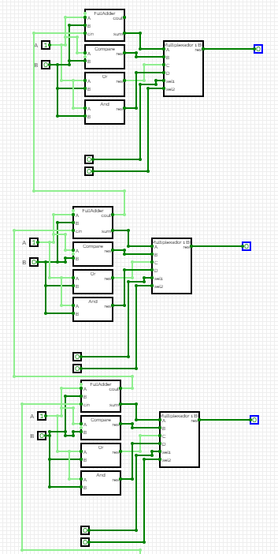

Autores: Matheus Kretzmann e Nicolas Arcari

exemplo1:  
entrada A: 111111  
entrada B: 10000

sel: 00 

.PNG)

saída: 000000

exemplo 2 

entrada A: 000000  
entrada B: 111111

sel: 00

.PNG)  
(1).PNG)
saída: 000000  
exemplo 3

entrada A: 111111  
entrada B: 111111

sel: 11

(1).PNG)

(2).PNG)

saida: 111111

exemplo 4  
entrada A:000000  
entrada B:111111

sel: 10  
(1).PNG)
(2).PNG)
saída : 111111

exemplo 5:

entrada A:111111  
entrada B:111111

sel:10

(1).PNG)
(2).PNG)

saída: 111111

